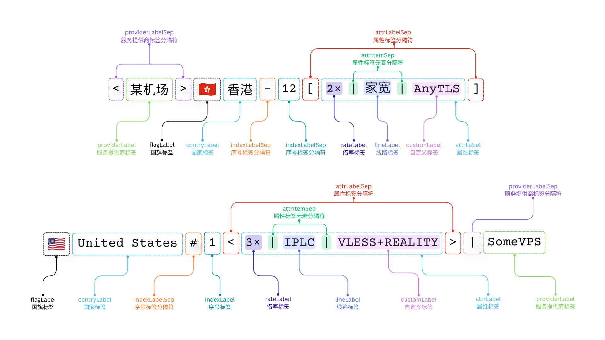

# Sub-Store 节点重命名脚本

## 概述
本脚本（rename.js）专为 Sub-Store 订阅节点的名称标准化、标签拼接、分组排序与多语言输出而设计。支持灵活参数配置、强大自定义标签、智能国家/地区识别、倍率与线路标签处理，适用于机场/VPS订阅节点的批量美化、分组与筛选。

## 功能特性
- 🌍 **多语言与多格式支持**：支持中文、英文、国旗、国家代码等多种输出格式，自动识别节点原始名称类型。
- 🏷️ **灵活标签拼接**：支持倍率、线路、自定义标签、机场名等多标签灵活组合，分隔符可自定义。
- 🧠 **智能国家/地区识别**：内置200+国家/地区映射，支持多种别名与变体自动识别。
- 🔢 **分组排序与序号**：支持按国家、倍率、线路、自定义标签多级分组排序，并可为同组节点自动添加序号。
- 🧹 **节点筛选与清理**：可过滤无效节点、未匹配节点、倍率区间筛选、单节点序号清理等。
- 🔧 **自定义标签与重命名**：支持自定义标签批量添加与重命名，满足个性化分组与展示需求。
- 🔒 **本地纯净执行**：无任何外部依赖，所有处理均在本地完成，保障数据安全与隐私。

## 参数说明
| 参数名                | 取值                      | 默认值 | 说明 |
|----------------------|---------------------------|--------|------|
| countryLabelType     | zh\|en\|code              | zh     | 国家标签类型（中文/英文/国家代码） |
| providerLabel        | 任意字符串                 | （空） | 机场/VPS标签 |
| providerLabelPos     | head\|tail                | head   | 机场标签位置 |
| addFlagLabel         | true\|false               | true   | 是否添加国旗标签 |
| addRateLabel         | true\|false               | false  | 是否添加倍率标签 |
| addLineLabel         | true\|false               | false  | 是否添加线路标签 |
| customLabel          | 关键词1\|关键词2...        | （空） | 自定义标签与重命名，支持“关键词>新名字”|
| filterInvalid        | true\|false               | true   | 过滤无效节点 |
| filterUnmatched      | true\|false               | false  | 过滤未匹配国家节点 |
| rateRange            | 区间表达式，如 !1.5\|,2\|5 | （空） | 倍率区间筛选，支持多区间与取反 |
| providerLabelSep     | 1-2字符                   | \|     | 机场标签分隔符 |
| indexLabelSep        | 1-2字符                   | #      | 序号分隔符 |
| tagSep               | 1-2字符                   | []     | 标签整体分隔符 |
| tagItemSep           | 1字符                     | \|     | 标签项分隔符 |
| sortNodes            | true\|false               | false  | 是否分组排序 |
| rmSingleIdx          | true\|false               | false  | 单节点时移除序号 |
| blockQuic            | true\|false               | false  | 是否阻止QUIC协议 |

## 结构示意图

下图展示了各标签、分隔符、参数在节点名称中的具体位置与含义（中英文对照）：



## 使用方法
1. 所有参数均通过 `#参数1=值1&参数2=值2...` 参数必须以#开头，多个参数用 `&` 连接，经过 URI 编码后，再拼接到脚本URL后面。如需禁用缓存，则在末尾拼接#noCache。
2. 在 Sub-Store 订阅管理->单条订阅->脚本操作中添加本地脚本或脚本链接：
	
	```
	https://raw.githubusercontent.com/cwbitz/substore-rename-script/refs/heads/main/rename.js#addFlagLabel=true&countryLabelType=en&customLabel=%E6%B5%81%E5%AA%92%E4%BD%93#noCache
	```

## 常用示例
- 添加国旗与英文国家名：
	```
	addFlagLabel=true
	countryLabelType=en
	```
- 在末尾添加机场标签并自定义分隔符：
	```
	providerLabel=MyVPS
	providerLabelSep=<>
	providerLabelPos=tail
	```
- 只保留倍率大于2的节点：
	```
	rateRange=2|
	```
- 匹配自定义标签并重命名：
	```
	customLabel=流媒体>Streaming|VLESS+WS+REALITY
	```

## 支持的国家/地区
- 内置200+国家/地区映射，支持多语言、国旗、别名自动识别。
- 例如：🇭🇰 香港 / Hong Kong / HK，🇺🇸 美国 / United States / US，🇬🇧 英国 / United Kingdom / GB 等。

## 技术实现
- 主入口函数 `operator(nodes)`，支持 Sub-Store 与 Node.js 环境。
- 所有处理均为纯函数，无副作用，便于二次开发与集成。
- 详细参数校验与防御性编程，兼容 Sub-Store QuickJS 环境。

## 安全与隐私
- 完全本地处理，无任何外部网络请求。
- 不上传、不存储任何用户数据。
- 代码开源透明，便于安全审计。

## 许可证
本项目采用 MIT 开源许可证，欢迎自由使用与二次开发。